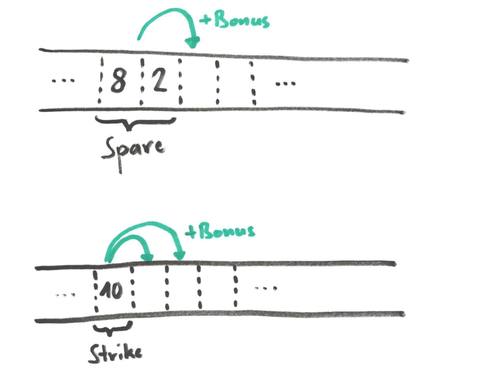
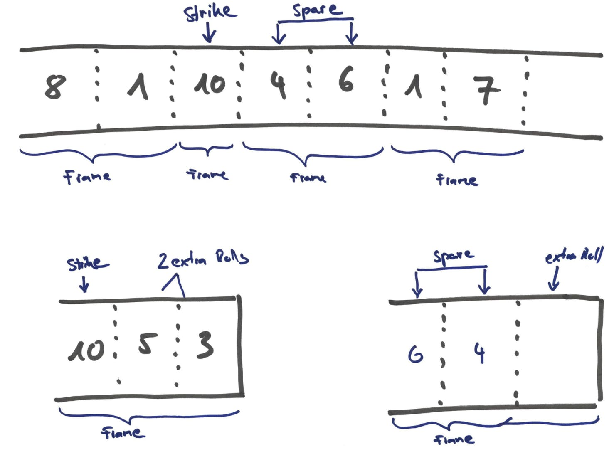

# bowlingkata-empty

## Basic Rules
- 10 frames
- at most 2 rolls per frame
  - except for last frame
- 1 point per pin
- 0-10 points per roll

## Strikes & Spares
- spare = all 10 pins in one frame
  - spare bonus: points of the next roll
- strike = all 10 pins in one roll
  - strike bonus: points of the next two rolls

  

## Last Frame

If the last frame is a spare or a strike, it will have consist of three roles.

## Examples

- `10 * (0,0) = 0`
- `10 * (1,0) = 10`
- `9 * (5,5) + (5, 5, 5) = 150`
- `9 * (10) + (10, 10, 10) = 300`
- `(0,1) + (10)  + (9, 1) + (3, 3) + 6 * (0, 0) = 40`

### Notation
In the examples above, we use the following notation
- `()` marks a frame
  - `(10)` is a strike
  - `(3, 5)` is a frame where the first roll was 3 pins and the second roll was 5 pins
- `+` is the separator for a sequence of frames
  - `(4, 1) + (5, 2)` means that first the frame `(4, 1)` was rolled and then the frame `(5,2)`
- `n * x` means that the same frame `x` was rolled multiple times
  - `3 * (4,5)` means that the frame `(4, 5)` has been rolled three times in sequence
  - `3 * (4,5)` is a shorthand notation for `(4,5) + (4, 5) + (4, 5)`
  